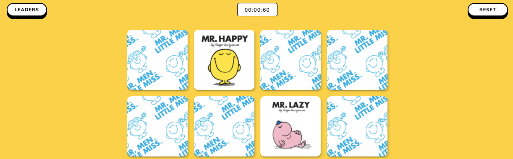

# About

This is the backend part of Mr Men Memory Match.

Basically a micro-service for storing and retreiving best times.

## How to Install

```sh
npm install
```

Setup a local Postgres database.
Add environmental variables in a .env file with SERVER_PORT and a DATABASE_URL connection string.

## How to Run

- `npm run build` - Build the project by running the TypeScript complier
- `npm run start` - Start the server in production
- `npm run serve` - Start the server in devlopment

## How to Deploy

How you deploy your back end will largely depend on whether you want to host it on a rented cloud server (VPS) or a managed server (PaaS).
